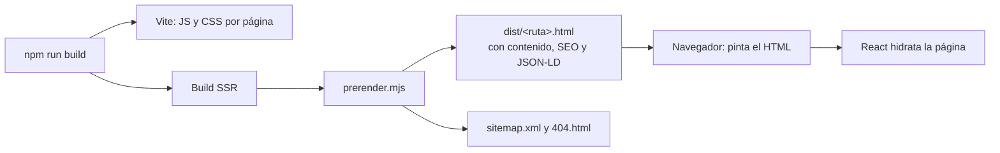
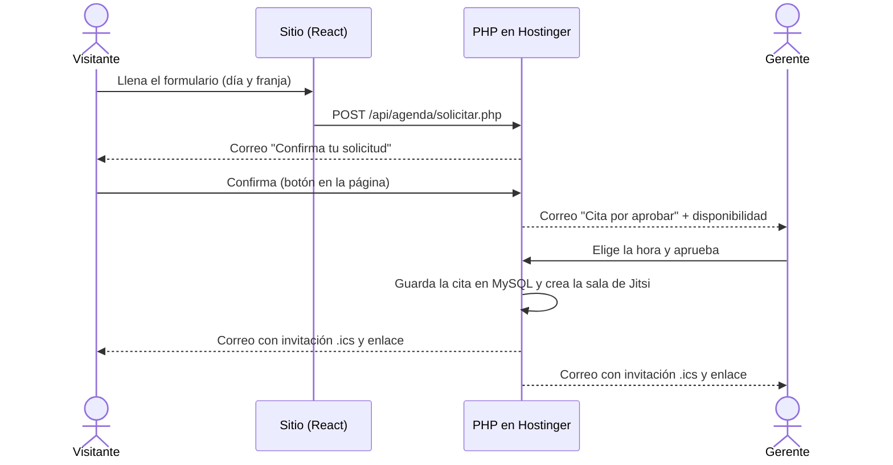

# Céntrica · Sitio web corporativo

Sitio web de **Céntrica Soluciones Innovadoras S.A.S.** (Medellín, Colombia):
presenta los servicios de la empresa y permite agendar reuniones virtuales con
el gerente comercial.


Se Migró el sitio original en HTML estático a una aplicación React con estas
características:

- **Prerenderizado:** cada página se entrega como HTML completo, así carga
  rápido y los buscadores la leen sin ejecutar JavaScript.
- **Responsive:** funciona desde 360 px hasta pantallas de escritorio.
- **Agenda de citas 100 % en Hostinger:** con doble confirmación por correo,
  aprobación del gerente, calendario propio en MySQL, invitación de calendario
  (`.ics`) y videollamada de Jitsi Meet. No depende de ninguna cuenta de Google.

---

## Contenido

- [Qué incluye esta entrega](#qué-incluye-esta-entrega)
- [Páginas del sitio](#páginas-del-sitio)
- [Tecnologías](#tecnologías)
- [Puesta en marcha](#puesta-en-marcha)
- [Scripts disponibles](#scripts-disponibles)
- [Variables de entorno](#variables-de-entorno)
- [Estructura del proyecto](#estructura-del-proyecto)
- [Arquitectura](#arquitectura)
- [Agenda de citas](#agenda-de-citas)
- [Nebulina, la asistente virtual](#nebulina-la-asistente-virtual)
- [Rendimiento](#rendimiento)
- [SEO](#seo)
- [Seguridad](#seguridad)
- [Accesibilidad y diseño responsive](#accesibilidad-y-diseño-responsive)
- [Despliegue en Hostinger](#despliegue-en-hostinger)
- [Cómo agregar una página nueva](#cómo-agregar-una-página-nueva)
- [Pendientes antes de producción](#pendientes-antes-de-producción)

---

## Qué incluye esta entrega

| Área | Qué hice |
| --- | --- |
| **Migración** | Pasé las páginas HTML originales a componentes React reutilizables, con un sistema de diseño común (tokens de color, modo claro/oscuro, tarjetas, hero, carrusel, línea de tiempo). |
| **Nueva página** | Agregué *Evaluaciones de Calidad* (`/evaluaciones-calidad`), que había quedado fuera de la migración. |
| **Agenda de citas** | Reemplacé la integración con Google por un backend PHP en Hostinger. Tiene confirmación por correo, panel de aprobación para el gerente, calendario propio con festivos de Colombia, invitación `.ics` y sala de Jitsi Meet por cita. |
| **Nebulina** | Asistente virtual flotante en todas las páginas: responde según la página y el contexto, tolera errores de escritura, recuerda la conversación, recomienda soluciones, agenda con el servicio preseleccionado y conecta con el gerente por WhatsApp o correo. |
| **Estado del formulario** | El borrador se conserva mientras la pestaña esté abierta. Si alguien sale sin enviar, al volver ve el aviso *"Tienes un agendamiento pendiente"* y elige si continuar o cancelar. |
| **Anti-spam** | Siete capas de protección para que al gerente solo le lleguen solicitudes reales. Las detallo en [Protección contra abuso](#protección-contra-abuso). |
| **Rendimiento** | Prerenderizado, carga diferida por página, imágenes WebP en varios tamaños, video solo en escritorio y fuentes alojadas en el propio sitio. |
| **SEO** | Metadatos por página, datos estructurados (Schema.org), migas de pan, sitemap y URL canónicas. |
| **Seguridad** | CSP estricta, cabeceras HTTP, lista blanca de enlaces externos, datos personales cifrados con AES-256-GCM (una clave por cliente), límites anti-abuso atómicos y protección DDoS con Cloudflare. |
| **Contenido legal** | Política de privacidad (Ley 1581 de 2012), cookies, términos de servicio y aviso legal. |

---

## Páginas del sitio

| Ruta | Página |
| --- | --- |
| `/` | Sobre nosotros (inicio) |
| `/servicios` | Catálogo de servicios |
| `/fabrica-software` | Fábrica de software |
| `/nebula-erp` | Nebula ERP |
| `/sicovi` | SICOVI · Sistema Concejo Visible |
| `/analisis-ia` | Soluciones de IA |
| `/evaluaciones-calidad` | Evaluaciones de Calidad |
| `/consultoria-digital` | Consultoría digital |
| `/contacto` | Contacto y agenda de citas |
| `/privacidad` · `/cookies` · `/terservicios` · `/legal` | Páginas legales |
| `/blog` | En construcción (no se indexa) |

---

## Tecnologías

| Capa | Tecnología |
| --- | --- |
| Interfaz | React 19, React Router 7, react-helmet-async |
| Animaciones | GSAP (respeta la preferencia de "reducir movimiento") |
| Íconos y tipografía | Lucide, Open Sans Variable (alojada en el sitio) |
| Compilación | Vite 8, con prerenderizado propio vía SSR (`scripts/prerender.mjs`) |
| Backend de citas | PHP 8.1+, MySQL, PHPMailer (SMTP de Hostinger) |
| Calendario y videollamada | Calendario propio en MySQL, invitaciones iCalendar (`.ics`), Jitsi Meet |
| Anti-bots | Cloudflare Turnstile |
| Calidad de código | ESLint 10 con las reglas de SonarJS y React Hooks; SonarLint/SonarQube (perfil *Sonar way*) sin incidencias en JS, CSS, HTML y PHP |

---

## Puesta en marcha

**Requisitos:** Node.js 20.19+ o 22.12+ (lo exige Vite 8) y npm.

```bash
git clone <url-del-repositorio>
cd Proyecto_Centrica
npm install
cp .env.example .env      # opcional en desarrollo
npm run dev               # http://localhost:5173
```

> [!NOTE]
> `.npmrc` tiene `ignore-scripts=true`: ninguna dependencia puede ejecutar
> código al instalarse. Si `npm install` falla por una vulnerabilidad moderada o
> mayor, es intencional (`audit-level=moderate`).

Para probar el formulario de citas en local, levanto el backend PHP en el puerto
8080. Vite le reenvía `/api` automáticamente; los pasos están en
[`integraciones/agenda-hostinger/README.md`](integraciones/agenda-hostinger/README.md#probar-en-local).

---

## Scripts disponibles

| Comando | Qué hace |
| --- | --- |
| `npm run dev` | Servidor de desarrollo con recarga en caliente. |
| `npm run dev:red` | Igual, accesible desde otros dispositivos de la red local (para probar en el celular). |
| `npm run build` | Compila el sitio y genera el HTML de cada página, `404.html` y `sitemap.xml` en `dist/`. |
| `npm run preview` | Sirve `dist/` imitando el hosting: redirecciones 301 y un 404 real. |
| `npm run preview:red` | Compila y sirve `dist/` en la red local. |
| `npm run compartir` | Compila y publica un enlace temporal `https://…trycloudflare.com` para mostrar el sitio a terceros. Requiere `cloudflared`. |
| `npm run lint` | Revisa el código con ESLint, incluidas las reglas de SonarQube para JavaScript (`eslint-plugin-sonarjs`). |
| `npm run seguridad` | Auditoría de dependencias (`npm audit`) y lint. |

> [!TIP]
> El enlace de `npm run compartir` sirve la carpeta `dist/`. Después de cambiar
> algo, vuelvo a ejecutar `npm run build` (o reinicio `compartir`) para que el
> enlace muestre la versión nueva.

---

## Variables de entorno

Se definen en `.env` (plantilla en `.env.example`) y se leen **al compilar**.

| Variable | Obligatoria | Descripción |
| --- | --- | --- |
| `VITE_TURNSTILE_SITEKEY` | Sí, en producción | Clave **pública** de Cloudflare Turnstile. Si está vacía, el widget no se muestra. |
| `VITE_AGENDA_ENDPOINT` | No | URL del backend de citas. Por defecto es `/api/agenda/solicitar.php`. |

> [!IMPORTANT]
> Las claves secretas (base de datos, SMTP y Turnstile) **nunca** van en `.env`
> ni en el repositorio. Viven en `config.php`, en el servidor y fuera de
> `public_html`.

---

## Estructura del proyecto

```text
Proyecto_Centrica/
├── integraciones/
│   └── agenda-hostinger/              # Backend PHP + guía de instalación
│       └── agenda-privado/            # Va FUERA de public_html: src/ (clases), autoload.php, esquema.sql
├── public/
│   ├── api/agenda/                    # Puntos de entrada PHP (se copian a dist/)
│   ├── robots.txt, favicon, og-centrica.jpg
│   └── theme-init.js                  # Aplica el tema antes de pintar (sin parpadeo)
├── scripts/
│   ├── prerender.mjs                  # HTML estático por página + sitemap
│   └── compartir.mjs                  # Enlace público temporal
├── src/
│   ├── components/
│   │   ├── common/                    # Utilidades (imagen diferida, Turnstile, enlaces…)
│   │   ├── layout/                    # Header y Footer
│   │   ├── legal/                     # Plantilla de páginas legales
│   │   ├── nebulina/                  # Asistente virtual (burbuja, chat y motor)
│   │   └── ui/                        # Hero, tarjetas, carrusel, línea de tiempo, CTA…
│   ├── config/                        # agenda.js, nebulina.js, seo.js, legal.js
│   ├── hooks/                         # Tema, animaciones, media queries
│   ├── pages/                         # Una carpeta por página
│   ├── styles/                        # tokens, base, layout, componentes, secciones
│   ├── App.jsx                        # Rutas y precarga de páginas
│   ├── main.jsx                       # Hidratación en el navegador
│   └── entry-server.jsx               # Render para el prerenderizado
├── security.config.js                 # CSP y cabeceras (.htaccess, _headers)
└── vite.config.js
```

---

## Arquitectura



- **Prerenderizado e hidratación.** Cada ruta de `src/config/seo.js` se genera
  como HTML completo. El navegador lo muestra de inmediato y React lo "hidrata"
  después. El build **falla** si una página sale sin `<h1>`, con etiquetas
  duplicadas o con un enlace a un dominio externo no autorizado.
- **Carga diferida.** Cada página es un paquete JavaScript independiente. Cuando
  el navegador queda libre, precargo las páginas principales para que navegar
  entre ellas sea instantáneo.
- **Una sola fuente de verdad.** Rutas, migas de pan y sitemap salen de `RUTAS`
  en `src/config/seo.js`. Las cabeceras de seguridad para cualquier hosting
  salen de `security.config.js`.

---

## Agenda de citas

### Flujo



1. **Solicitud.** El visitante elige un día hábil y una franja (mañana, tarde o
   cualquiera). La solicitud queda *por confirmar*.
2. **Confirmación.** Le llega un correo desde el buzón de Hostinger. El enlace
   vence en 24 horas.
3. **Aprobación.** El gerente recibe el aviso con los datos y con sus horas
   libres de ese día. Esas horas excluyen fines de semana, festivos de Colombia
   y las horas que ya tienen otra cita. Desde la página de gestión elige una y
   aprueba, o rechaza la solicitud con un mensaje para el cliente.
4. **Reunión.** La cita queda guardada en MySQL con una sala de Jitsi Meet
   única. El cliente y el gerente reciben un correo con el enlace y la
   invitación `.ics`, que se agrega con un clic a cualquier calendario. El
   cliente entra sin cuenta; el gerente inicia sesión en Jitsi (GitHub o
   Facebook) para abrir la sala.

El plazo de respuesta que comunico al visitante es de **máximo 2 días hábiles**.

### Protección contra abuso

| Capa | Efecto |
| --- | --- |
| Doble confirmación por correo | El gerente solo recibe solicitudes de correos reales y confirmados. |
| Cloudflare Turnstile obligatorio | Bloquea bots. Si la verificación falla, la solicitud se rechaza. |
| Campo trampa y tiempo mínimo de llenado | Descarta envíos automáticos. |
| Validación de `Origin` y tamaño máximo (8 KB) | Solo se aceptan envíos desde el propio dominio. |
| Límites de frecuencia | 3 por IP por hora, 6 por IP al día, 3 por correo al día y 30 en total al día. |
| Enlaces con tokens aleatorios | En la base de datos solo se guarda su hash. Las acciones exigen pulsar un botón (POST), así los filtros de correo que abren enlaces no confirman ni aprueban nada. |
| Índice único por hora | No puede haber dos citas a la misma hora, aunque se aprueben al mismo tiempo. |

Además, los correos al visitante llevan solo texto fijo, para que el formulario
no se pueda usar para enviar spam en nombre de Céntrica. Las solicitudes no
confirmadas se borran a los 7 días.

### Borrador del formulario

- Lo escrito se guarda en `sessionStorage` mientras el usuario escribe. Nunca
  guardo la aceptación de datos personales.
- Si el usuario cambia de página, recarga o cierra la pestaña sin enviar, al
  volver ve el aviso **"Tienes un agendamiento pendiente"** con dos opciones:
  *Seguir con mi solicitud* o *Cancelarla y empezar de nuevo*.
- El borrador se borra al cerrar la pestaña, al enviar o al cancelar (en un
  computador compartido, el siguiente usuario no ve los datos). Así está
  declarado en la Política de Cookies.

---

## Nebulina, la asistente virtual

Nebulina es un asistente **guiado** (sin servicios de IA externos): entiende
lo que escribe el visitante por palabras clave y responde con el contenido real
del sitio. No da precios ni plazos cerrados y siempre ofrece hablar con el
gerente.

| Capacidad | Detalle |
| --- | --- |
| Contexto por página | Saluda según la hora y la página, y sugiere las preguntas más útiles de esa página. |
| Lenguaje natural | Ignora tildes, mayúsculas y signos; tolera errores de escritura ("facturasion") y plurales. |
| Memoria | Recuerda el nombre ("me llamo Ana"), el servicio del que se habla ("¿y cuánto cuesta?") y los temas consultados. |
| Recomendación | "¿Qué solución necesito?" orienta según la necesidad del visitante. |
| Agenda | "Agendar una reunión" abre `/contacto` con el servicio ya elegido en el formulario. |
| Contacto con el gerente | WhatsApp con el mensaje ya escrito, llamada o mensaje al correo del gerente con los temas consultados. |
| Conversación persistente | Sigue al recargar o navegar (solo en la pestaña); botón de "Nueva conversación". |
| Inactividad | Sin interacción tras una respuesta, pregunta "¿Sigues por aquí?" a los 60 s; sin respuesta, se despide y cierra a los 45 s, sin perder la conversación. |
| Parpadeo | Nebulina parpadea en todas sus imágenes con CSS puro (sin JavaScript); se desactiva con "reducir movimiento". |

**Cómo amplío lo que sabe.** Todo el conocimiento vive en
`src/config/nebulina.js`: cada tema tiene sus palabras clave, su respuesta y
sus botones. Para agregar uno, creo el tema en `TEMAS` y, si quiero sugerirlo
en una página, lo agrego en `PAGINAS` y su texto en `ETIQUETAS`. Los tiempos
de inactividad también se ajustan ahí.

**Rendimiento y seguridad.**

- La burbuja aparece después de cargar la página y no forma parte del HTML que
  leen los buscadores. El chat (unos 14 KB) se descarga solo al abrirlo.
- Todo el texto se pinta como texto, nunca como HTML: lo que escriba el
  visitante no puede inyectar código. Lo guardado en el navegador se valida al
  leerlo.
- El mensaje al gerente pasa por las mismas protecciones de la agenda
  (Turnstile, campo trampa, origen, límites) y solo se envía al correo del
  gerente, nunca a terceros.

---

## Rendimiento

| Técnica | Detalle |
| --- | --- |
| HTML prerenderizado | La primera pintura no espera a JavaScript. |
| Carga diferida por página | Cada página solo descarga su propio código (unos 10 KB por página de servicio). |
| Imágenes WebP responsivas | Entre 2 y 4 anchos por imagen. Cada pantalla descarga solo el suyo, con `width` y `height` declarados para que el contenido no salte. |
| Video del hero | Solo en escritorio con mouse y sin ahorro de datos. En celular se usa la imagen. |
| Recursos propios | Fuentes, íconos e imágenes se sirven desde el mismo dominio, sin CDN de terceros. |
| Caché | Recursos con hash cacheados un año (`immutable`). El HTML se revalida en cada visita. |
| Animaciones | Con GSAP. Se desactivan si el usuario prefiere reducir el movimiento. |

---

## SEO

- Título, descripción, Open Graph y Twitter Card propios en cada página.
- URL canónicas: HTTPS, sin `www`, sin `.html` y sin barra final, con
  redirección 301.
- Datos estructurados Schema.org en JSON-LD: `Organization`, `WebSite`,
  `WebPage`, `BreadcrumbList` y `Service`.
- `sitemap.xml` generado en cada build, `robots.txt` y un 404 real (no una
  página vacía con código 200).

---

## Seguridad

- **CSP estricta.** Defino cada dominio externo solo en la directiva que lo
  necesita. Sin scripts ni estilos en línea, y sin manejadores de eventos en
  atributos. Cuando Turnstile no está activo, también activo *Trusted Types*.
- **Cabeceras HTTP.** HSTS, `X-Frame-Options`, `Referrer-Policy`,
  `Permissions-Policy`, COOP y CORP, generadas para Apache (`.htaccess`) y para
  Netlify o Cloudflare Pages (`_headers`).
- **Archivos sensibles.** Los archivos ocultos (`.env`, `.git`, …) nunca se
  sirven. Las credenciales del backend viven fuera de `public_html`.
- **Enlaces externos.** El build falla si aparece un enlace a un dominio que no
  está en la lista blanca (`DOMINIOS_EXTERNOS`).
- **Dependencias.** Ningún paquete ejecuta scripts al instalarse, y `npm run
  seguridad` audita las vulnerabilidades.
- **Backend.** Datos personales cifrados en la base (AES-256-GCM, una clave
  por cliente), límites anti-abuso atómicos, errores sin datos sensibles en
  los registros y protección DDoS con Cloudflare. Detalle en
  [`integraciones/agenda-hostinger/SEGURIDAD.md`](integraciones/agenda-hostinger/SEGURIDAD.md).

---

## Accesibilidad y diseño responsive

- Diseño probado en celular (360 px), tablet (768 px) y escritorio, sin
  desplazamiento horizontal.
- Enlace "Saltar al contenido", foco visible y navegación completa con teclado.
- Las tarjetas que giran son botones accesibles, y los formularios tienen
  errores asociados a cada campo (`aria-describedby`).
- El carrusel se desliza con el dedo, se pausa con el mouse o el foco, y deja de
  avanzar solo en cuanto el usuario lo toca.
- Modo claro y oscuro sin parpadeo al cargar.

---

## Despliegue en Hostinger

```text
domains/centricasoluciones.com/
├── agenda-privado/     ← backend PHP privado (config.php con las credenciales)
└── public_html/        ← contenido de dist/
```

1. Configuro `.env` con `VITE_TURNSTILE_SITEKEY` y ejecuto `npm run build`.
2. Subo el contenido de `dist/` a `public_html/`. Incluye el `.htaccess` y los
   PHP de `api/agenda/`.
3. La primera vez instalo el backend de citas: base de datos MySQL, buzón SMTP,
   Turnstile y claves. Sigo la guía de
   [`integraciones/agenda-hostinger/README.md`](integraciones/agenda-hostinger/README.md).

> [!WARNING]
> La carpeta `agenda-privado/` va **al lado** de `public_html`, nunca dentro. Si
> por error queda dentro, su `.htaccess` bloquea el acceso, pero esa no es la
> ubicación correcta.

---

## Cómo agregar una página nueva

1. Creo `src/pages/MiPagina/index.jsx` usando los componentes de
   `src/components/ui` y un objeto `SEO` con `path`.
2. Si la página lleva hero, agrego sus imágenes `Hero-<Nombre>-<ancho>.webp` en
   `src/assets/images/Imagenes/Hero/`.
3. La registro en `RUTAS` de `src/config/seo.js`, que la incluye en el
   prerenderizado y el sitemap.
4. Agrego su `<Route>` en `src/App.jsx` y, si es un servicio, su enlace en
   `Header.jsx` y en la grilla de `/servicios`.
5. Ejecuto `npm run lint && npm run build`.

---

## Pendientes antes de producción

- [ ] Crear en Hostinger la base de datos y el buzón
      `agenda@centricasoluciones.com`, y completar `config.php`.
- [ ] Confirmar que el gerente tiene una cuenta de GitHub o Facebook para abrir
      las salas de Jitsi.
- [ ] Crear el widget de Cloudflare Turnstile y configurar sus dos claves.
- [ ] Revisar los textos de la sección "Conoce a Nebulina": hoy dicen
      "impulsado por inteligencia artificial" y "aprendizaje continuo", pero
      Nebulina es un asistente guiado.
- [ ] Hacer una prueba completa de punta a punta con los servicios reales
      (correo, MySQL e invitación `.ics` en Outlook y en el celular).
- [ ] Validar con el área comercial las cifras publicadas en las tarjetas de
      beneficios (por ejemplo, porcentajes de reducción de defectos) y el
      contador de proyectos de la página de inicio.
- [ ] Revisión legal de la Política de Privacidad y la de Cookies, actualizadas
      para Hostinger y Jitsi Meet.

---

## Autor

**Santiago Calle Londoño**, desarrollo e implementación del sitio web de
Céntrica Soluciones Innovadoras S.A.S.
© 2026 Céntrica Soluciones Innovadoras S.A.S. Todos los derechos reservados.
