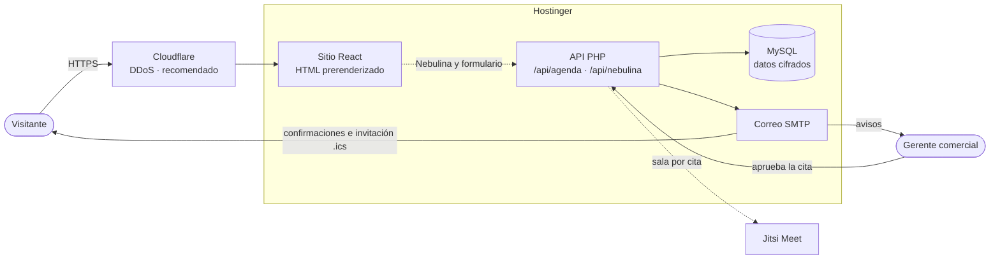
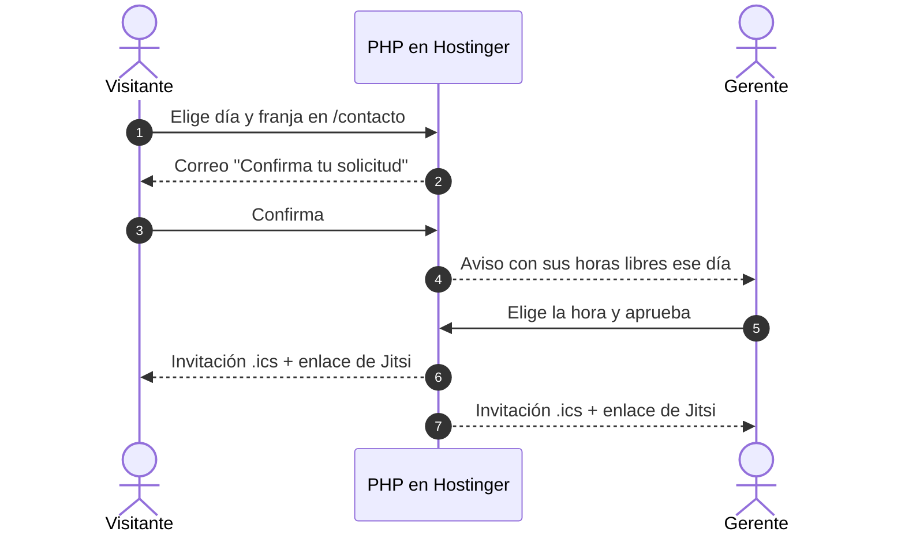

<div align="center">


# Céntrica · Sitio web corporativo

**Software a la medida, Nebula ERP, SICOVI, IA, calidad y consultoría,
desde Medellín para Colombia.**


[Qué incluye](#-qué-incluye) ·
[Nebulina](#-nebulina-la-asistente-virtual) ·
[Agenda](#-agenda-de-citas) ·
[Seguridad](#-seguridad) ·
[Empezar](#-puesta-en-marcha) ·
[Despliegue](#-despliegue-en-hostinger) ·
[Documentación](#-documentación)

</div>

---

## ✨ Qué incluye

Desarrollé el sitio web de **Céntrica Soluciones Innovadoras S.A.S.** como
una aplicación React prerenderizada: cada página llega como HTML completo
(rápida y legible para los buscadores) y después cobra vida en el navegador.
Todo corre en **Hostinger**, sin depender de cuentas de Google.

| | Área | Qué hace |
| :-: | --- | --- |
| 🌐 | **Sitio** | 14 páginas responsive (servicios, contacto, legales y blog), modo claro y oscuro, animaciones que respetan "reducir movimiento". |
| 🤖 | **Nebulina** | Asistente virtual flotante en todas las páginas: entiende preguntas escritas con errores, recuerda la conversación, recomienda soluciones y conecta con el gerente. Parpadea. |
| 📅 | **Agenda de citas** | Doble confirmación por correo, aprobación del gerente, calendario propio con festivos de Colombia, invitación `.ics` y videollamada de Jitsi Meet. |
| 🔒 | **Seguridad** | Datos personales cifrados (AES-256-GCM, una clave por cliente), anti-spam en capas, CSP estricta y protección DDoS con Cloudflare. |
| ⚡ | **Rendimiento** | Prerenderizado, carga diferida por página, imágenes WebP por tamaño de pantalla y el chat descargado solo al abrirlo. |
| 🔎 | **SEO** | Metadatos por página, datos estructurados Schema.org, migas de pan, sitemap y URL canónicas. |
| ✅ | **Calidad** | 0 incidencias en SonarQube (JS, CSS, HTML y PHP), ESLint con reglas de SonarJS y Markdown verificado con markdownlint. |

---

## 🗺️ Arquitectura



---

## 🤖 Nebulina, la asistente virtual

<table>
<tr>
<td width="62%" valign="top">

Nebulina vive en una burbuja flotante en todas las páginas y acompaña al
visitante mientras navega.

- 💬 **Entiende lo que escriben**, sin importar tildes ni mayúsculas, y tolera
  errores ("facturasion", "nomnia").
- 🧭 **Sabe en qué página estás** y sugiere las preguntas más útiles de esa
  página; si cambias de página, lo nota.
- 🧠 **Recuerda** tu nombre y el servicio del que hablaban ("¿y cuánto
  cuesta?").
- 🎯 **Recomienda** la solución adecuada y **agenda** con el servicio ya
  elegido.
- 🙋 **Conecta con el gerente** por WhatsApp, llamada o un mensaje a su correo.
- ⏱️ Si no respondes, pregunta *"¿Sigues por aquí?"* y luego se despide sin
  perder la conversación.
- 😉 **Parpadea** en todas sus imágenes, solo con CSS.

</td>
<td width="38%" valign="top">

```text
👋 ¡Buenas tardes! Soy Nebulina.
   Veo que te interesa Nebula ERP.

   [¿Qué módulos tiene?]
   [¿Tiene facturación electrónica?]
   [Quiero una demostración]

🙂 ¿y cuánto cuesta?

👋 Cada proyecto de Nebula ERP se
   cotiza a la medida...
   [Agendar una reunión]
   [Escribir por WhatsApp]
```

</td>
</tr>
</table>

Todo lo que sabe está en
[`src/config/nebulina.js`](Proyecto_Centrica/src/config/nebulina.js): agregar
un tema es escribir sus palabras clave, su respuesta y sus botones.

---

## 📅 Agenda de citas



<details>
<summary><b>Ver las reglas de la agenda</b></summary>

- Solo días hábiles, sin festivos de Colombia (calculados para cualquier año).
- Horario de 8:00 a 12:00 y de 2:00 a 6:00 p. m., citas de 30 minutos.
- Dos citas nunca pueden quedar a la misma hora.
- Respuesta comunicada al visitante: máximo 2 días hábiles.
- Si el visitante sale sin enviar, al volver ve *"Tienes un agendamiento
  pendiente"* y elige si continuar.

</details>

---

## 🔒 Seguridad

| Capa | Protección |
| --- | --- |
| 🗄️ Datos | Nombre, correo, empresa y mensaje cifrados con AES-256-GCM y una clave derivada por cliente; del correo solo se guarda una huella HMAC |
| 🤖 Bots | Cloudflare Turnstile obligatorio, campo trampa y tiempo mínimo de llenado |
| 🚦 Abuso | Límites por IP, por correo y diarios, atómicos ante peticiones simultáneas |
| 🌊 DDoS | Cloudflare delante del dominio y límites de Apache para `/api` |
| 🧱 Navegador | CSP estricta, sin scripts en línea, cabeceras HTTP endurecidas y lista blanca de enlaces externos |
| 📝 Registros | Los errores no guardan credenciales ni datos personales |
| 🧹 Minimización | Solicitudes no confirmadas borradas a los 7 días; borradores y chat solo mientras la pestaña esté abierta |

Detalle, configuración y riesgos residuales en
[`SEGURIDAD.md`](Proyecto_Centrica/integraciones/agenda-hostinger/SEGURIDAD.md).

---

## 🚀 Puesta en marcha

**Requisitos:** Node.js 20.19+ o 22.12+ y npm.

```bash
git clone https://github.com/centricasolucionesdiseno-ux/landing.git
cd landing/Proyecto_Centrica
npm install
npm run dev          # http://localhost:5173
```

<details>
<summary><b>Todos los comandos</b></summary>

| Comando | Qué hace |
| --- | --- |
| `npm run dev` | Servidor de desarrollo con recarga en caliente |
| `npm run build` | Compila y genera el HTML de cada página, `404.html` y `sitemap.xml` |
| `npm run preview` | Sirve `dist/` igual que el hosting |
| `npm run compartir` | Publica un enlace temporal para mostrar el sitio (requiere `cloudflared`) |
| `npm run lint` | ESLint con las reglas de SonarQube para JavaScript |
| `npm run seguridad` | Auditoría de dependencias y lint |

</details>

<details>
<summary><b>Probar la agenda y Nebulina en local</b></summary>

El backend PHP corre aparte en el puerto 8080 y Vite le reenvía `/api`. Los
pasos están en
[`integraciones/agenda-hostinger/README.md`](Proyecto_Centrica/integraciones/agenda-hostinger/README.md#probar-en-local).

</details>

---

## 🌍 Despliegue en Hostinger

```text
domains/centricasoluciones.com/
├── agenda-privado/     ← backend PHP privado (config.php con las claves)
└── public_html/        ← contenido de dist/
```

1. Configuro `.env` con la clave pública de Turnstile y ejecuto
   `npm run build`.
2. Subo `dist/` a `public_html/`.
3. La primera vez instalo el backend: MySQL, buzón SMTP, claves y Cloudflare.
   Sigo la
   [guía de instalación](Proyecto_Centrica/integraciones/agenda-hostinger/README.md).

> [!WARNING]
> `agenda-privado/` va **al lado** de `public_html`, nunca dentro, y
> `clave_cifrado` se guarda también en un gestor de contraseñas: si se pierde,
> los datos cifrados no se recuperan.

---

## 📁 Estructura del repositorio

```text
landing/
├── .github/
│   ├── assets/banner.svg        # Banner animado de este README
│   └── dependabot.yml           # Actualizaciones semanales de dependencias
└── Proyecto_Centrica/           # Aplicación
    ├── src/                     # React: páginas, componentes, Nebulina, estilos
    ├── public/api/              # Puntos de entrada PHP (se copian a dist/)
    ├── integraciones/
    │   └── agenda-hostinger/    # Backend PHP privado, guía y seguridad
    └── scripts/                 # Prerenderizado y enlace para compartir
```

---

## 📚 Documentación

| Documento | Contenido |
| --- | --- |
| [README de la aplicación](Proyecto_Centrica/README.md) | Detalle técnico completo: arquitectura, rendimiento, SEO, accesibilidad y cómo agregar páginas |
| [Guía del backend](Proyecto_Centrica/integraciones/agenda-hostinger/README.md) | Instalación en Hostinger, estructura del código PHP y pruebas locales |
| [Seguridad](Proyecto_Centrica/integraciones/agenda-hostinger/SEGURIDAD.md) | Controles, protección DDoS, operación y riesgos residuales |

---

<div align="center">

**Santiago Calle Londoño** · Desarrollo e implementación

© 2026 Céntrica Soluciones Innovadoras S.A.S. Todos los derechos reservados.

</div>
